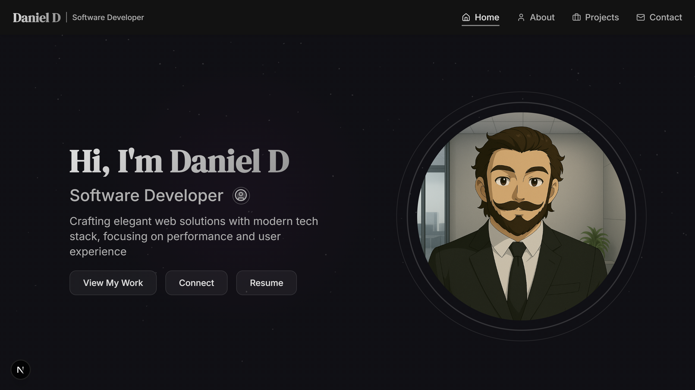

# Portfolio

A modern, responsive portfolio website built with Next.js 15, React 19, and Tailwind CSS. This project showcases a professional portfolio with a focus on performance and user experience.

🔗 **Portfolio:** [Click here](https://daniel-d-portfolio.netlify.app/)




## 🚀 Features

- Built with Next.js 15 and React 19
- Modern UI with Tailwind CSS
- Responsive design
- Dark mode
- Smooth animations with Framer Motion
- Carousel functionality with Embla Carousel
- TypeScript for type safety
- ESLint for code quality

## 🛠️ Tech Stack

- **Framework:** Next.js 15.3.3
- **UI Library:** React 19
- **Styling:** Tailwind CSS
- **Animation:** Framer Motion
- **Carousel:** Embla Carousel
- **UI Components:** Radix UI
- **Theme:** next-themes
- **Language:** TypeScript
- **Linting:** ESLint

## 📦 Installation

1. Clone the repository:
```bash
git clone https://github.com/MrDanielD326/Portfolio.git
```

2. Install dependencies:
```bash
npm install
```

3. Run the development server:
```bash
npm run dev
```

4. Open [http://localhost:3000](http://localhost:3000) in your browser.

## 🏗️ Project Structure

```
portfolio/
├── src/
│   ├── app/          # Next.js app directory
│   ├── components/   # Reusable UI components
│   ├── docs/         # Documentation
│   ├── hooks/        # Custom React hooks
│   ├── lib/          # Library code
│   └── utils/        # Utility functions
├── public/           # Static assets
└── ...config files
```

## 🚀 Available Scripts

- `npm run dev` - Start development server with Turbopack
- `npm run build` - Build for production
- `npm run start` - Start production server
- `npm run lint` - Run ESLint

## 🔧 Configuration Files

- `next.config.mjs` - Next.js configuration
- `tailwind.config.ts` - Tailwind CSS configuration
- `tsconfig.json` - TypeScript configuration
- `eslint.config.mjs` - ESLint configuration
- `postcss.config.mjs` - PostCSS configuration
